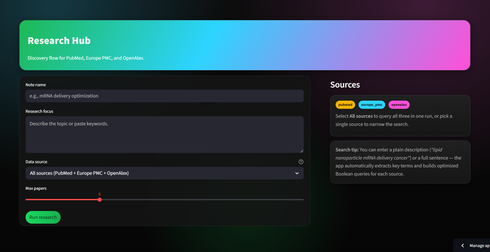

# Research Hub

A Streamlit web application that streamlines academic literature discovery 
by querying PubMed, Europe PMC, and OpenAlex simultaneously from a single 
plain language search.

**[Try the live app →](https://rsrchfinder.streamlit.app/)**



---

## The Problem

Researchers conducting literature reviews must manually search multiple 
databases — each with different query syntax, interfaces, and results. 
Writing optimized Boolean queries for PubMed alone takes expertise and time. 
Doing it across three databases is a significant barrier, especially for 
researchers early in a project or exploring unfamiliar territory.

## The Solution

Research Hub takes a plain language description of your research focus and 
automatically builds optimized Boolean queries for each database, runs them 
in parallel, and returns consolidated results in one place.

- **Plain language input** — describe your topic naturally, no Boolean syntax required
- **AI-optimized queries** — automatically converts input into database-specific Boolean search strings
- **Three databases in one run** — PubMed, Europe PMC, and OpenAlex queried simultaneously
- **Flexible sourcing** — query all three at once or narrow to a single source
- **Note naming** — organize searches by project or topic for reference

## Who It's For

- Graduate students conducting literature reviews
- Researchers exploring new topic areas
- Lab members tracking developments across multiple fields
- Anyone who wastes time reformulating the same search across databases

## Getting Started

```bash
git clone https://github.com/kobeqanderson-png/rsrchassistantstreamlit.git
cd rsrchassistantstreamlit
python -m venv .venv
source .venv/bin/activate           # Mac/Linux
.\.venv\Scripts\Activate.ps1        # Windows
pip install -r requirements.txt
streamlit run app.py
```

Or use the live app — no installation needed:  
**https://rsrchfinder.streamlit.app/**

## Example Usage

Enter a research focus like:

> "dopamine reward learning in rodent models of addiction"

Research Hub extracts key terms, builds optimized Boolean queries for each 
database, and returns consolidated results — in seconds.

## Data Sources

| Source | Coverage |
|---|---|
| PubMed | Biomedical and life sciences literature |
| Europe PMC | Life sciences including preprints and grey literature |
| OpenAlex | Broad academic literature across all disciplines |

## Built With

- Python, Streamlit
- PubMed API (Entrez)
- Europe PMC REST API
- OpenAlex API

## Author

Kobe Anderson — Graduate Research Assistant, Laboratory for Comparative 
Neuropsychology, Towson University  
[LinkedIn](https://www.linkedin.com/in/kobe-anderson-1a9793330)

## License

MIT License — free to use, modify, and distribute with attribution.
